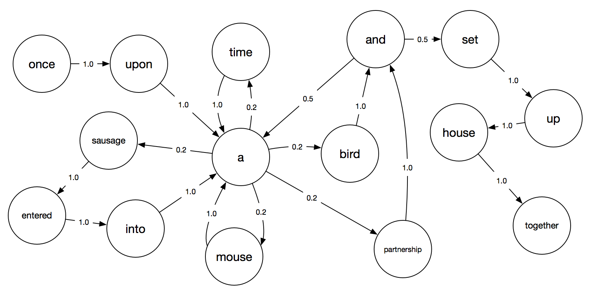

# Markov_Text_Generator
Use Markov Chain to Generate Text

## What is a Markov Chain ?
A Markov chain is a stochastic model describing a sequence of possible events in which the probability of each event depends only on the state attained in the previous event.

Using Probabilistic connections a Markov Chain can be used to generate text.

## Training Data
The data should be in form of a text file. An example of presidential speeches has been provied.

## Generating a Dictionary
To generate a dictionary file, you'll need to run the genDict.py script as follows:
```
python genDict.py -k <key length> -i <input files> -d <output dictionary file>
```
  
For eg:
```
python genDict.py -k 2 -i Presidents\*.* -d pdict.txt
```
**Note: Wild Card characters can be used for input**

## Generating the Text
To generate the text, you'll need to run the genText.py script as follows:
```
python genText.py -w <max word count> -n <max line count> -d <dictionary file>
```

For eg:
```
python genText.py -w 100 -n 5 -d pdict.txt
```

# G00D LUCK

For doubts email me at:
atinsaki@gmail.com
